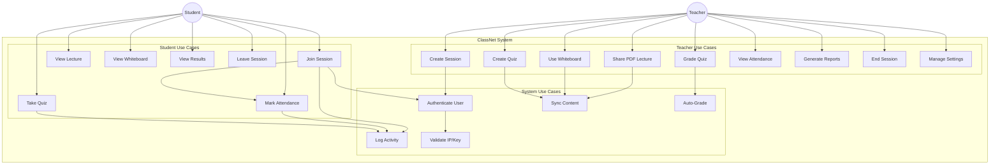
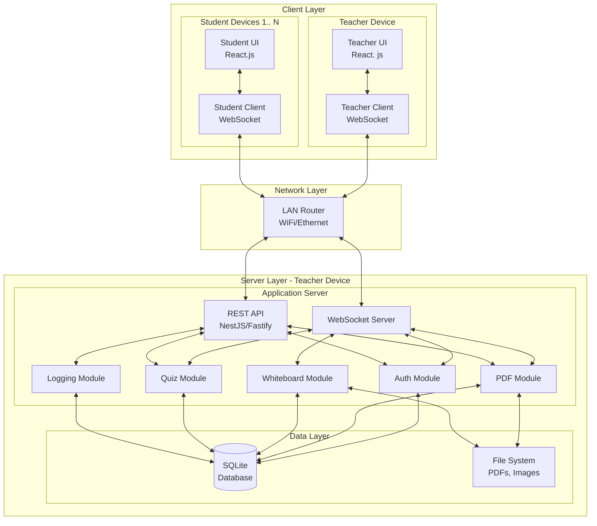
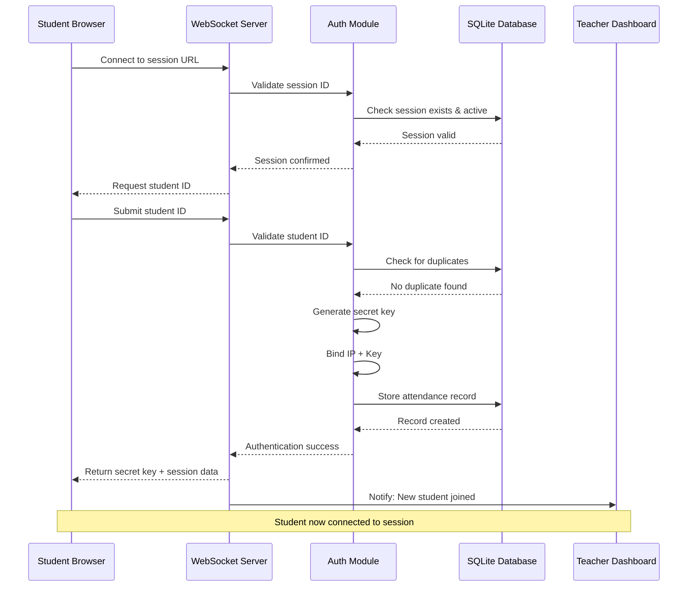
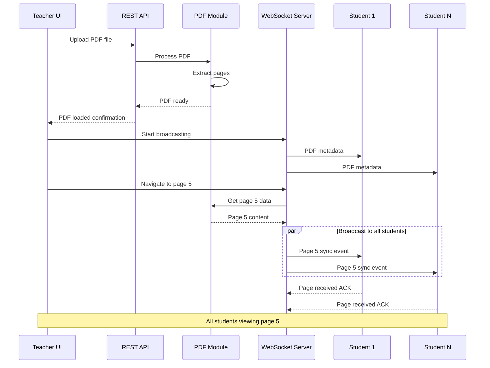
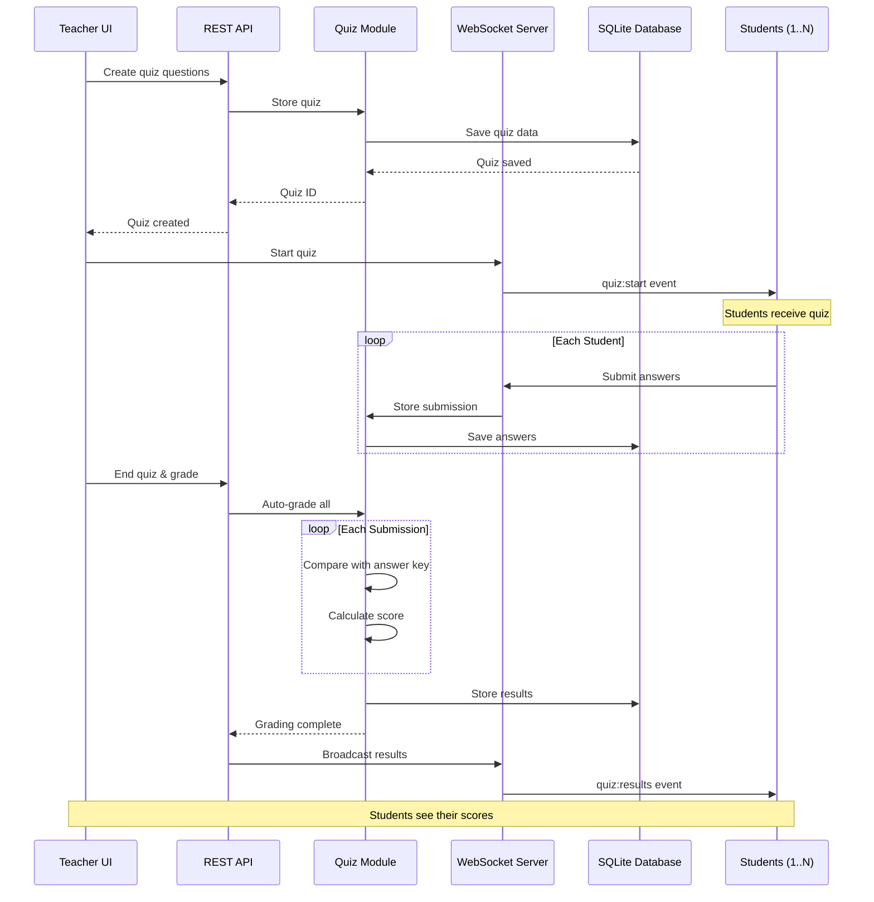
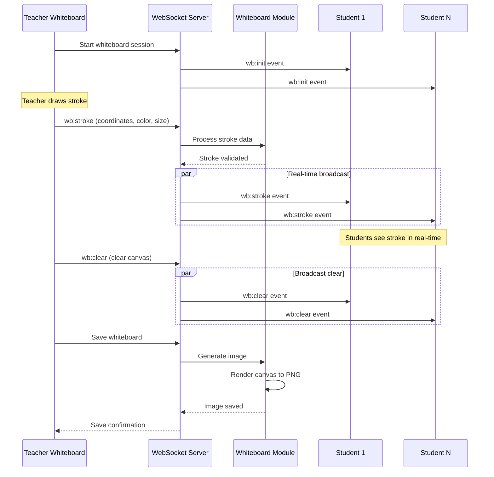
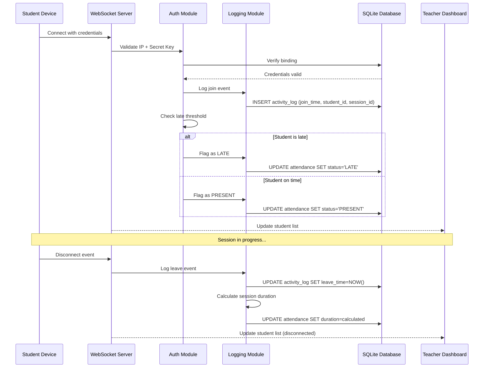
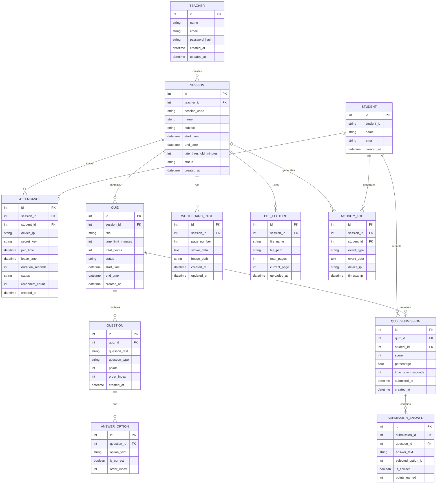

# Software Requirements Specification

## ClassNet - Offline LAN-Based Classroom Management System

**Version:** 1.0  
**Date:** December 4, 2025  
**Document Status:** Final  
**Prepared By:** ClassNet Development Team

---

## Document Revision History

| Version | Date       | Author              | Description                     |
|---------|------------|---------------------|---------------------------------|
| 1.0     | 2025-12-04 | ClassNet Dev Team   | Initial SRS Document Release   |

---

## Table of Contents

1. [Introduction](#1-introduction)

- 1.1 [Purpose](#11-purpose)
- 1.2 [Scope](#12-scope)
- 1.3 [Definitions, Acronyms, and Abbreviations](#13-definitions-acronyms-and-abbreviations)
- 1. 4 [References](#14-references)
- 1. 5 [Overview](#15-overview)

2. [Overall Description](#2-overall-description)
   - 2.1 [Product Perspective](#21-product-perspective)
   - 2. 2 [Product Functions](#22-product-functions)
   - 2.3 [User Classes and Characteristics](#23-user-classes-and-characteristics)
   - 2.4 [Operating Environment](#24-operating-environment)
   - 2.5 [Design and Implementation Constraints](#25-design-and-implementation-constraints)
   - 2. 6 [Assumptions and Dependencies](#26-assumptions-and-dependencies)
3. [System Features and Functional Requirements](#3-system-features-and-functional-requirements)

- 3. 1 [Authentication, Authorization & Attendance Module](#31-authentication-authorization--attendance-module)
- 3.2 [Lecture Module (PDF Broadcasting)](#32-lecture-module-pdf-broadcasting)
- 3. 3 [Whiteboard Module](#33-whiteboard-module)
- 3.4 [Quiz Module](#34-quiz-module)
- 3.5 [Activity Logging & Reporting Module](#35-activity-logging--reporting-module)

4. [External Interface Requirements](#4-external-interface-requirements)
   - 4.1 [User Interfaces](#41-user-interfaces)
   - 4. 2 [Hardware Interfaces](#42-hardware-interfaces)
   - 4.3 [Software Interfaces](#43-software-interfaces)
   - 4.4 [Communication Interfaces](#44-communication-interfaces)
5. [Non-Functional Requirements](#5-non-functional-requirements)
   - 5.1 [Performance Requirements](#51-performance-requirements)
   - 5.2 [Reliability Requirements](#52-reliability-requirements)
   - 5.3 [Scalability Requirements](#53-scalability-requirements)
   - 5.4 [Security Requirements](#54-security-requirements)
   - 5. 5 [Usability Requirements](#55-usability-requirements)
   - 5.6 [Offline Operation Requirements](#56-offline-operation-requirements)
   - 5.7 [Device Compatibility Requirements](#57-device-compatibility-requirements)
   - 5.8 [Maintainability Requirements](#58-maintainability-requirements)
6. [System Diagrams](#6-system-diagrams)
   - 6. 1 [Use Case Diagram](#61-use-case-diagram)
   - 6.2 [System Architecture Diagram](#62-system-architecture-diagram)
   - 6.3 [Module Interaction Sequence Diagrams](#63-module-interaction-sequence-diagrams)
7. [Database Schema](#7-database-schema)
   - 7.1 [Entity Relationship Overview](#71-entity-relationship-overview)
   - 7. 2 [Table Definitions](#72-table-definitions)
8. [Glossary](#8-glossary)
9. [Appendices](#9-appendices)
   - 9. 1 [Appendix A: Technology Stack Details](#91-appendix-a-technology-stack-details)
   - 9. 2 [Appendix B: API Endpoint Reference](#92-appendix-b-api-endpoint-reference)
   - 9. 3 [Appendix C: Deployment Guide](#93-appendix-c-deployment-guide)

---

## 1. Introduction

### 1.1 Purpose

This Software Requirements Specification (SRS) document provides a comprehensive description of the ClassNet system—an offline, LAN-based classroom management platform.  This document is intended for:

- **Development Team:** To guide the design, development, and testing phases
- **Project Stakeholders:** To validate requirements and expectations
- **Quality Assurance Team:** To develop test cases and validation criteria
- **Future Maintainers:** To understand system architecture and functionality

This SRS follows the IEEE 830-1998 standard for software requirements specifications.

### 1. 2 Scope

**ClassNet** is a web-based classroom management system designed to operate entirely offline within a Local Area Network (LAN) environment. The system enables educational institutions to conduct interactive classroom sessions without requiring internet connectivity.

#### Product Goals

- Enable seamless classroom management in offline environments
- Support 50-70 concurrent student connections per session
- Provide real-time lecture content synchronization
- Facilitate interactive quizzes with automated grading
- Ensure accurate attendance tracking with anti-fraud mechanisms
- Deliver low-latency whiteboard broadcasting

#### Benefits

- **Zero Internet Dependency:** Full functionality over LAN
- **Cost-Effective:** No recurring cloud service costs
- **Secure:** All data remains within the local network
- **Reliable:** No external service outages affect operation

#### Exclusions

- Cloud synchronization features
- Multi-campus networking
- Video conferencing capabilities
- External API integrations

### 1.3 Definitions, Acronyms, and Abbreviations

| Term | Definition |
|------|------------|
| LAN | Local Area Network - A network connecting devices within a limited area |
| SRS | Software Requirements Specification |
| WebSocket | A protocol providing full-duplex communication channels over TCP |
| WebRTC | Web Real-Time Communication - A technology for peer-to-peer communication |
| PDF | Portable Document Format |
| API | Application Programming Interface |
| JWT | JSON Web Token - A compact token format for secure information transmission |
| CRUD | Create, Read, Update, Delete operations |
| UI | User Interface |
| UX | User Experience |
| SQLite | A self-contained, file-based relational database engine |
| NestJS | A progressive Node.js framework for building server-side applications |
| Fastify | A fast and low overhead web framework for Node.js |

### 1.4 References

| Reference | Description |
|-----------|-------------|
| IEEE 830-1998 | IEEE Recommended Practice for Software Requirements Specifications |
| RFC 6455 | The WebSocket Protocol |
| WebRTC 1.0 | W3C Real-Time Communication specification |
| SQLite Documentation | Official SQLite database documentation |
| React.js Documentation | Official React.js library documentation |
| Node.js Documentation | Official Node.js runtime documentation |

### 1.5 Overview

The remainder of this document is organized as follows:

- **Section 2** provides an overall description of the product including its context, functions, user characteristics, constraints, and dependencies.
- **Section 3** details all functional requirements organized by system modules.
- **Section 4** specifies all external interface requirements.
- **Section 5** describes non-functional requirements including performance, security, and usability.
- **Section 6** presents system diagrams for visual understanding.
- **Section 7** defines the database schema and data models.
- **Section 8** provides a glossary of terms.
- **Section 9** contains appendices with additional technical information.

---

## 2. Overall Description

### 2. 1 Product Perspective

ClassNet is a self-contained, standalone system designed to operate independently within educational institution premises. The system architecture consists of:

```
┌─────────────────────────────────────────────────────────────────┐
│                    CLASSNET ECOSYSTEM                           │
├─────────────────────────────────────────────────────────────────┤
│                                                                 │
│   ┌─────────────┐         ┌─────────────────────────┐           │
│   │   Router    │◄───────►│   Teacher's Device      │           │
│   │  (LAN Hub)  │         │   (Server Host)         │           │
│   └──────┬──────┘         └─────────────────────────┘           │
│          │                                                      │
│          │ LAN Connection (No Internet Required)                │
│          │                                                      │
│   ┌──────┴──────────────────────────────────────────┐           │
│   │                                                 │           │
│   ▼                  ▼                  ▼           │           │
│ ┌─────────┐    ┌─────────┐        ┌─────────┐       │           │
│ │Student 1│    │Student 2│  ...    │Student N│      │           │
│ │ Device  │    │ Device  │        │ Device  │       │           │
│ └─────────┘    └─────────┘        └─────────┘       │           │
│                                                     │           │
│            (50-70 Concurrent Connections)           │           │
│                                                                 │
└─────────────────────────────────────────────────────────────────┘
```

#### System Context

- **Teacher's Device:** Hosts the ClassNet server and serves as the central hub
- **LAN Router:** Provides network connectivity between all devices
- **Student Devices:** Connect as clients via web browsers

### 2.2 Product Functions

ClassNet provides the following major functions:

```
┌────────────────────────────────────────────────────────────────┐
│                    CLASSNET CORE FUNCTIONS                     │
├────────────────────────────────────────────────────────────────┤
│                                                                │
│  ┌──────────────────┐    ┌──────────────────┐                  │
│  │  AUTHENTICATION  │    │    ATTENDANCE    │                  │
│  │  & AUTHORIZATION │    │    MANAGEMENT    │                  │
│  └────────┬─────────┘    └────────┬─────────┘                  │
│           │                       │                            │
│           └───────────┬───────────┘                            │
│                       │                                        │
│           ┌───────────┴───────────┐                            │
│           │    SESSION CONTROL    │                            │
│           └───────────┬───────────┘                            │
│                       │                                        │
│     ┌─────────────────┼─────────────────┐                      │
│     │                 │                 │                      │
│     ▼                 ▼                 ▼                      │
│ ┌───────┐       ┌───────────┐     ┌─────────┐                  │
│ │LECTURE│       │WHITEBOARD │     │  QUIZ   │                  │
│ │ (PDF) │       │ BROADCAST │     │ MODULE  │                  │
│ └───┬───┘       └─────┬─────┘     └────┬────┘                  │
│     │                 │                │                       │
│     └─────────────────┼────────────────┘                       │
│                       │                                        │
│                       ▼                                        │
│              ┌─────────────────┐                               │
│              │ ACTIVITY LOGGING│                               │
│              │   & REPORTING   │                               │
│              └─────────────────┘                               │
│                                                                │
└────────────────────────────────────────────────────────────────┘
```

#### Function Summary

| Function | Description |
|----------|-------------|
| Session Management | Create, manage, and terminate classroom sessions |
| Authentication | Secure student identification with IP + secret key binding |
| Attendance Tracking | Automated attendance with late detection and fraud prevention |
| PDF Broadcasting | Real-time lecture slide synchronization |
| Whiteboard | Live drawing broadcast with low latency |
| Quiz System | Question delivery, submission, auto-grading, and analytics |
| Activity Logging | Comprehensive session activity tracking |
| Report Generation | Automated attendance and quiz reports |

### 2.3 User Classes and Characteristics

#### 2.3.1 Teacher (Primary User)

| Attribute | Description |
|-----------|-------------|
| **Role** | Session host, content creator, administrator |
| **Technical Expertise** | Basic to intermediate computer literacy |
| **Frequency of Use** | Daily during class sessions |
| **Privileges** | Full system access, all administrative functions |
| **Responsibilities** | Create sessions, share content, conduct quizzes, manage attendance |

#### 2.3.2 Student (End User)

| Attribute | Description |
|-----------|-------------|
| **Role** | Session participant, content consumer |
| **Technical Expertise** | Basic computer/smartphone literacy |
| **Frequency of Use** | Daily during class sessions |
| **Privileges** | View content, submit quiz answers, mark attendance |
| **Responsibilities** | Join sessions, participate in activities |

#### 2. 3.3 System Administrator (Optional)

| Attribute | Description |
|-----------|-------------|
| **Role** | System maintenance and configuration |
| **Technical Expertise** | Intermediate to advanced technical knowledge |
| **Frequency of Use** | Occasional (setup, maintenance) |
| **Privileges** | System configuration, data backup, troubleshooting |
| **Responsibilities** | Initial setup, system maintenance, data management |

### 2.4 Operating Environment

#### 2.4.1 Hardware Environment

| Component | Minimum Specification | Recommended Specification |
|-----------|----------------------|---------------------------|
| **Teacher's Device (Server)** | | |
| Processor | Intel Core i3 / AMD Ryzen 3 | Intel Core i5 / AMD Ryzen 5 |
| RAM | 4 GB | 8 GB |
| Storage | 10 GB free space | 50 GB free space (SSD) |
| Network | 100 Mbps Ethernet / WiFi | Gigabit Ethernet |
| **Student Devices (Client)** | | |
| Device Type | Smartphone / Tablet / Laptop | Any modern device |
| RAM | 2 GB | 4 GB |
| Browser | Any modern browser | Chrome / Firefox (latest) |
| **Network Equipment** | | |
| Router | Standard WiFi router | Enterprise-grade WiFi router |
| Bandwidth | 100 Mbps | 1 Gbps |
| Concurrent Connections | 50 | 100+ |

#### 2.4.2 Software Environment

| Component | Requirement |
|-----------|-------------|
| **Server Operating System** | Windows 10/11, macOS 10.15+, Ubuntu 20.04+ |
| **Node.js Runtime** | Version 18.x LTS or higher |
| **Web Browsers** | Chrome 90+, Firefox 88+, Safari 14+, Edge 90+ |
| **Database** | SQLite 3.x (bundled) |

### 2.5 Design and Implementation Constraints

| Constraint Category | Description |
|--------------------|-------------|
| **Network** | System must operate without internet connectivity |
| **Connectivity** | Maximum 70 concurrent student connections |
| **Latency** | Real-time features must maintain < 100ms latency on LAN |
| **Storage** | All data stored locally on teacher's device |
| **Technology** | React.js frontend, Node.js backend (NestJS/Fastify) |
| **Database** | SQLite for lightweight, file-based storage |
| **Protocol** | WebSocket for real-time communication |
| **Compatibility** | Must work on common browsers and devices |

### 2.6 Assumptions and Dependencies

#### Assumptions

1. A functional LAN router is available and properly configured
2. Teacher's device has sufficient resources to host the server
3. All student devices have compatible web browsers
4. Network bandwidth is adequate for 50-70 concurrent connections
5. Teachers have basic technical literacy to start the application
6. Power supply is stable during sessions

#### Dependencies

1. **Node.js Runtime:** Required for server operation
2. **Modern Web Browser:** Required on all client devices
3. **LAN Infrastructure:** Router and network cables/WiFi
4. **SQLite:** Database engine for data persistence
5. **WebSocket Support:** Browser support for real-time features

---

## 3.  System Features and Functional Requirements

### 3.1 Authentication, Authorization & Attendance Module

#### 3. 1.1 Description

This module handles user authentication, session security, and comprehensive attendance tracking. It ensures secure access through IP binding and secret key verification while preventing duplicate attendance and impersonation.

#### 3.1. 2 Functional Requirements

##### FR-AUTH-001: Session Creation

| Attribute | Description |
|-----------|-------------|
| **ID** | FR-AUTH-001 |
| **Title** | Teacher Session Creation |
| **Description** | Teacher shall be able to create a new classroom session with a unique session identifier |
| **Priority** | High |
| **Inputs** | Session name, subject, duration (optional), attendance window |
| **Outputs** | Unique session URL, session ID, QR code (optional) |
| **Preconditions** | ClassNet server is running on teacher's device |
| **Postconditions** | Session is created and accessible via LAN URL |

##### FR-AUTH-002: Session Link Generation

| Attribute | Description |
|-----------|-------------|
| **ID** | FR-AUTH-002 |
| **Title** | LAN Session Link Generation |
| **Description** | System shall generate a LAN-accessible URL for student connections |
| **Priority** | High |
| **Inputs** | Teacher's device IP address, session ID |
| **Outputs** | URL format: `http://<teacher-ip>:<port>/session/<session-id>` |
| **Preconditions** | Session is created |
| **Postconditions** | URL is displayed and copyable for distribution |

##### FR-AUTH-003: Student Session Join

| Attribute | Description |
|-----------|-------------|
| **ID** | FR-AUTH-003 |
| **Title** | Student Session Join |
| **Description** | Students shall be able to join a session by entering their student ID |
| **Priority** | High |
| **Inputs** | Session URL, Student ID |
| **Outputs** | Session access, unique secret key |
| **Preconditions** | Valid session URL, session is active |
| **Postconditions** | Student is connected, attendance recorded |

##### FR-AUTH-004: Secret Key Generation

| Attribute | Description |
|-----------|-------------|
| **ID** | FR-AUTH-004 |
| **Title** | Unique Secret Key Generation |
| **Description** | System shall generate a unique secret key for each student upon joining |
| **Priority** | High |
| **Inputs** | Student ID, Device IP, Session ID, Timestamp |
| **Outputs** | 256-bit unique secret key (stored securely) |
| **Preconditions** | Student submits valid student ID |
| **Postconditions** | Key is stored and used for subsequent authentication |

##### FR-AUTH-005: IP + Key Binding

| Attribute | Description |
|-----------|-------------|
| **ID** | FR-AUTH-005 |
| **Title** | Device IP and Secret Key Binding |
| **Description** | System shall bind student's secret key to their device IP address |
| **Priority** | High |
| **Inputs** | Student secret key, Device IP address |
| **Outputs** | Bound authentication pair |
| **Preconditions** | Secret key generated |
| **Postconditions** | All requests validated against IP + key pair |

##### FR-AUTH-006: Duplicate Prevention

| Attribute | Description |
|-----------|-------------|
| **ID** | FR-AUTH-006 |
| **Title** | Duplicate Attendance Prevention |
| **Description** | System shall prevent a student ID from marking attendance more than once per session |
| **Priority** | High |
| **Inputs** | Student ID, Session ID |
| **Outputs** | Rejection message if duplicate detected |
| **Preconditions** | Student attempts to join |
| **Postconditions** | Only first valid attendance recorded |

##### FR-AUTH-007: Impersonation Prevention

| Attribute | Description |
|-----------|-------------|
| **ID** | FR-AUTH-007 |
| **Title** | Impersonation Prevention |
| **Description** | System shall detect and prevent use of another student's credentials from a different device |
| **Priority** | High |
| **Inputs** | Student ID, IP address, Secret key |
| **Outputs** | Alert to teacher, session blocked for offending device |
| **Preconditions** | Valid session in progress |
| **Postconditions** | Suspicious activity logged, teacher notified |

##### FR-AUTH-008: Attendance Time Window

| Attribute | Description |
|-----------|-------------|
| **ID** | FR-AUTH-008 |
| **Title** | Attendance Time Window Control |
| **Description** | Teacher shall define a time window during which attendance can be marked |
| **Priority** | Medium |
| **Inputs** | Start time, End time, Late threshold |
| **Outputs** | Attendance window configuration |
| **Preconditions** | Session created |
| **Postconditions** | Attendance restricted to defined window |

##### FR-AUTH-009: Late Detection

| Attribute | Description |
|-----------|-------------|
| **ID** | FR-AUTH-009 |
| **Title** | Late Arrival Detection |
| **Description** | System shall flag students who join after the defined threshold as "Late" |
| **Priority** | Medium |
| **Inputs** | Join timestamp, Late threshold |
| **Outputs** | Late flag on attendance record |
| **Preconditions** | Attendance window configured with late threshold |
| **Postconditions** | Late arrivals marked and logged |

##### FR-AUTH-010: Session Activity Logging

| Attribute | Description |
|-----------|-------------|
| **ID** | FR-AUTH-010 |
| **Title** | Comprehensive Activity Logging |
| **Description** | System shall log all session activities for each student |
| **Priority** | High |
| **Logged Data** | Join time, Leave time, Total duration, Reconnect attempts, Late/early flags |
| **Preconditions** | Student connected to session |
| **Postconditions** | Complete activity log available |

##### FR-AUTH-011: Attendance Report Generation

| Attribute | Description |
|-----------|-------------|
| **ID** | FR-AUTH-011 |
| **Title** | Automatic Attendance Report Generation |
| **Description** | System shall auto-generate attendance reports at session end |
| **Priority** | Medium |
| **Outputs** | CSV/PDF report with all attendance data |
| **Preconditions** | Session ended |
| **Postconditions** | Report available for download |

---

### 3.2 Lecture Module (PDF Broadcasting)

#### 3.2.1 Description

This module enables teachers to share PDF lecture materials with all connected students in real-time. The teacher controls navigation, and all students' views synchronize automatically.

#### 3.2.2 Functional Requirements

##### FR-LECT-001: PDF Upload

| Attribute | Description |
|-----------|-------------|
| **ID** | FR-LECT-001 |
| **Title** | PDF File Upload |
| **Description** | Teacher shall be able to upload/open a PDF file for broadcasting |
| **Priority** | High |
| **Inputs** | PDF file (max 100MB) |
| **Outputs** | PDF loaded in viewer, ready for broadcast |
| **Preconditions** | Active session |
| **Postconditions** | PDF available for page-by-page broadcasting |

##### FR-LECT-002: Real-time Page Sync

| Attribute | Description |
|-----------|-------------|
| **ID** | FR-LECT-002 |
| **Title** | Real-time Page Synchronization |
| **Description** | When teacher navigates to a page, all students shall see the same page instantly |
| **Priority** | High |
| **Inputs** | Page navigation event |
| **Outputs** | Synchronized page view across all clients |
| **Preconditions** | PDF loaded, students connected |
| **Postconditions** | All students viewing same page as teacher |

##### FR-LECT-003: Teacher Navigation Controls

| Attribute | Description |
|-----------|-------------|
| **ID** | FR-LECT-003 |
| **Title** | Teacher PDF Navigation Controls |
| **Description** | Teacher shall have controls for next, previous, go-to-page, and thumbnail navigation |
| **Priority** | High |
| **Inputs** | Navigation commands |
| **Outputs** | Page change broadcasted to all students |
| **Preconditions** | PDF loaded |
| **Postconditions** | Page changed and synchronized |

##### FR-LECT-004: Student View-Only Mode

| Attribute | Description |
|-----------|-------------|
| **ID** | FR-LECT-004 |
| **Title** | Student View-Only Restriction |
| **Description** | Students shall only be able to view the current page; navigation controls disabled |
| **Priority** | High |
| **Inputs** | None |
| **Outputs** | Read-only PDF view |
| **Preconditions** | Student connected to session |
| **Postconditions** | No student can change slides independently |

##### FR-LECT-005: Offline Operation

| Attribute | Description |
|-----------|-------------|
| **ID** | FR-LECT-005 |
| **Title** | Fully Offline PDF Broadcasting |
| **Description** | PDF broadcasting shall work entirely over LAN without internet |
| **Priority** | High |
| **Inputs** | PDF file on teacher's device |
| **Outputs** | PDF pages served over LAN |
| **Preconditions** | LAN connectivity established |
| **Postconditions** | All students receive PDF content locally |

##### FR-LECT-006: Page Rendering Quality

| Attribute | Description |
|-----------|-------------|
| **ID** | FR-LECT-006 |
| **Title** | High-Quality Page Rendering |
| **Description** | PDF pages shall render clearly on all device sizes |
| **Priority** | Medium |
| **Inputs** | PDF page data |
| **Outputs** | Responsive, zoomable page display |
| **Preconditions** | PDF loaded |
| **Postconditions** | Clear, readable content on all devices |

##### FR-LECT-007: Connection Status Indicator

| Attribute | Description |
|-----------|-------------|
| **ID** | FR-LECT-007 |
| **Title** | Student Connection Status |
| **Description** | Teacher shall see which students are connected and viewing the lecture |
| **Priority** | Medium |
| **Inputs** | WebSocket connection status |
| **Outputs** | Live student connection list |
| **Preconditions** | Active session |
| **Postconditions** | Real-time visibility of connected students |

---

### 3. 3 Whiteboard Module

#### 3.3.1 Description

This module provides a real-time digital whiteboard where the teacher can draw, annotate, and explain concepts. All drawings are broadcast instantly to all connected students.

#### 3.3.2 Functional Requirements

##### FR-WB-001: Whiteboard Canvas

| Attribute | Description |
|-----------|-------------|
| **ID** | FR-WB-001 |
| **Title** | Teacher Whiteboard Canvas |
| **Description** | Teacher shall have access to a full-screen drawing canvas |
| **Priority** | High |
| **Inputs** | Mouse/tablet input |
| **Outputs** | Drawing displayed on canvas |
| **Preconditions** | Active session |
| **Postconditions** | Canvas ready for drawing |

##### FR-WB-002: Drawing Tools

| Attribute | Description |
|-----------|-------------|
| **ID** | FR-WB-002 |
| **Title** | Whiteboard Drawing Tools |
| **Description** | System shall provide pen, highlighter, eraser, shapes, and text tools |
| **Priority** | High |
| **Available Tools** | Pen (multiple sizes), Highlighter, Eraser, Shapes (line, rectangle, circle, arrow), Text, Color picker, Undo/Redo |
| **Preconditions** | Whiteboard mode active |
| **Postconditions** | Tools available and functional |

##### FR-WB-003: Real-time Broadcast

| Attribute | Description |
|-----------|-------------|
| **ID** | FR-WB-003 |
| **Title** | Real-time Drawing Broadcast |
| **Description** | All drawing strokes shall be broadcast to students in real-time |
| **Priority** | High |
| **Latency** | < 50ms on LAN |
| **Protocol** | WebSocket (primary) / WebRTC (optional) |
| **Preconditions** | Students connected |
| **Postconditions** | Students see drawings as teacher creates them |

##### FR-WB-004: Student View Mode

| Attribute | Description |
|-----------|-------------|
| **ID** | FR-WB-004 |
| **Title** | Student Whiteboard Viewing |
| **Description** | Students shall view the whiteboard in read-only mode with zoom capability |
| **Priority** | High |
| **Features** | View, Zoom in/out, Pan |
| **Preconditions** | Connected to session |
| **Postconditions** | Clear view of teacher's whiteboard |

##### FR-WB-005: Canvas Clear/Reset

| Attribute | Description |
|-----------|-------------|
| **ID** | FR-WB-005 |
| **Title** | Canvas Clear and Reset |
| **Description** | Teacher shall be able to clear the entire canvas or create new pages |
| **Priority** | Medium |
| **Inputs** | Clear command |
| **Outputs** | Empty canvas / New page |
| **Preconditions** | Whiteboard active |
| **Postconditions** | Canvas cleared for all viewers |

##### FR-WB-006: Whiteboard Save

| Attribute | Description |
|-----------|-------------|
| **ID** | FR-WB-006 |
| **Title** | Whiteboard Image Save |
| **Description** | Teacher shall be able to save whiteboard as image (PNG/JPG) |
| **Priority** | Medium |
| **Inputs** | Save command |
| **Outputs** | Image file saved locally |
| **Preconditions** | Content on whiteboard |
| **Postconditions** | Image saved to teacher's device |

##### FR-WB-007: Student Download Option

| Attribute | Description |
|-----------|-------------|
| **ID** | FR-WB-007 |
| **Title** | Student Whiteboard Download (Optional) |
| **Description** | Teacher may enable students to download saved whiteboard images |
| **Priority** | Low |
| **Inputs** | Teacher permission |
| **Outputs** | Download option for students |
| **Preconditions** | Teacher enables feature |
| **Postconditions** | Students can download whiteboard snapshots |

##### FR-WB-008: Multi-page Support

| Attribute | Description |
|-----------|-------------|
| **ID** | FR-WB-008 |
| **Title** | Multiple Whiteboard Pages |
| **Description** | System shall support multiple whiteboard pages within a session |
| **Priority** | Medium |
| **Inputs** | New page command |
| **Outputs** | Additional whiteboard pages |
| **Preconditions** | Whiteboard active |
| **Postconditions** | Teacher can navigate between pages |

---

### 3. 4 Quiz Module

#### 3.4.1 Description

This module enables teachers to create, distribute, and automatically grade quizzes. It supports manual question creation and document-based auto-generation.

#### 3.4.2 Functional Requirements

##### FR-QUIZ-001: Quiz Creation

| Attribute | Description |
|-----------|-------------|
| **ID** | FR-QUIZ-001 |
| **Title** | Manual Quiz Creation |
| **Description** | Teacher shall be able to manually create quiz questions |
| **Priority** | High |
| **Question Types** | Multiple Choice, True/False, Short Answer, Fill in the Blank |
| **Inputs** | Question text, options, correct answer, points |
| **Outputs** | Quiz ready for distribution |
| **Preconditions** | Active session |
| **Postconditions** | Quiz saved and ready |

##### FR-QUIZ-002: Document Upload for Quiz

| Attribute | Description |
|-----------|-------------|
| **ID** | FR-QUIZ-002 |
| **Title** | Document-Based Quiz Upload |
| **Description** | Teacher shall upload a PDF/Text document for quiz content |
| **Priority** | High |
| **Supported Formats** | PDF, TXT, DOCX |
| **Inputs** | Document file |
| **Outputs** | Document parsed and ready for question generation |
| **Preconditions** | Active session |
| **Postconditions** | Document content available |

##### FR-QUIZ-003: Auto Question Generation

| Attribute | Description |
|-----------|-------------|
| **ID** | FR-QUIZ-003 |
| **Title** | Automatic Question Generation |
| **Description** | System shall auto-generate quiz questions from uploaded document |
| **Priority** | Medium |
| **Method** | Rule-based extraction (key sentences, definitions, facts) |
| **Inputs** | Parsed document content |
| **Outputs** | Generated questions for teacher review |
| **Preconditions** | Document uploaded |
| **Postconditions** | Questions generated, editable by teacher |

##### FR-QUIZ-004: Quiz Distribution

| Attribute | Description |
|-----------|-------------|
| **ID** | FR-QUIZ-004 |
| **Title** | Instant Quiz Distribution |
| **Description** | Teacher shall distribute quiz to all connected students simultaneously |
| **Priority** | High |
| **Inputs** | Start quiz command |
| **Outputs** | Quiz appears on all student devices |
| **Preconditions** | Quiz created, students connected |
| **Postconditions** | All students receive quiz |

##### FR-QUIZ-005: Student Answer Submission

| Attribute | Description |
|-----------|-------------|
| **ID** | FR-QUIZ-005 |
| **Title** | Student Quiz Submission |
| **Description** | Students shall submit answers from their devices |
| **Priority** | High |
| **Inputs** | Selected/typed answers |
| **Outputs** | Answers stored, submission confirmed |
| **Preconditions** | Quiz received |
| **Postconditions** | Answers recorded with timestamp |

##### FR-QUIZ-006: Answer Key Upload

| Attribute | Description |
|-----------|-------------|
| **ID** | FR-QUIZ-006 |
| **Title** | Answer Key Upload/Entry |
| **Description** | Teacher shall provide correct answers for grading |
| **Priority** | High |
| **Methods** | Manual entry, Document upload |
| **Inputs** | Correct answers |
| **Outputs** | Answer key stored |
| **Preconditions** | Quiz created |
| **Postconditions** | Answer key ready for grading |

##### FR-QUIZ-007: Auto Grading

| Attribute | Description |
|-----------|-------------|
| **ID** | FR-QUIZ-007 |
| **Title** | Automatic Quiz Grading |
| **Description** | System shall automatically grade all submitted quizzes |
| **Priority** | High |
| **Inputs** | Student answers, Answer key |
| **Outputs** | Scores calculated for all students |
| **Preconditions** | Quiz submitted, answer key available |
| **Postconditions** | All quizzes graded |

##### FR-QUIZ-008: Wrong Answer Display

| Attribute | Description |
|-----------|-------------|
| **ID** | FR-QUIZ-008 |
| **Title** | Wrong Answer Identification |
| **Description** | System shall highlight incorrect answers for each student |
| **Priority** | Medium |
| **Inputs** | Graded quiz |
| **Outputs** | Visual indication of wrong answers with correct answers shown |
| **Preconditions** | Quiz graded |
| **Postconditions** | Students can review mistakes |

##### FR-QUIZ-009: Quiz Statistics

| Attribute | Description |
|-----------|-------------|
| **ID** | FR-QUIZ-009 |
| **Title** | Quiz Statistics Generation |
| **Description** | System shall generate comprehensive quiz statistics |
| **Priority** | Medium |
| **Statistics** | Average score, Highest/Lowest score, Score distribution, Question-wise analysis, Completion time per student, Average completion time |
| **Preconditions** | Quiz graded |
| **Postconditions** | Statistics available for teacher |

##### FR-QUIZ-010: Time Limit

| Attribute | Description |
|-----------|-------------|
| **ID** | FR-QUIZ-010 |
| **Title** | Quiz Time Limit |
| **Description** | Teacher shall set optional time limit for quiz completion |
| **Priority** | Medium |
| **Inputs** | Duration in minutes |
| **Outputs** | Timer displayed, auto-submit on expiry |
| **Preconditions** | Quiz created |
| **Postconditions** | Quiz auto-submits when time expires |

---

### 3. 5 Activity Logging & Reporting Module

#### 3.5. 1 Description

This module provides comprehensive logging of all session activities and generates various reports for teacher review and record-keeping.

#### 3.5. 2 Functional Requirements

##### FR-LOG-001: Session Event Logging

| Attribute | Description |
|-----------|-------------|
| **ID** | FR-LOG-001 |
| **Title** | Comprehensive Session Event Logging |
| **Description** | System shall log all significant session events |
| **Priority** | High |
| **Events Logged** | Session start/end, Student joins/leaves, Page changes, Quiz events, Whiteboard actions, Errors |
| **Preconditions** | Active session |
| **Postconditions** | Complete event log maintained |

##### FR-LOG-002: Student Activity Tracking

| Attribute | Description |
|-----------|-------------|
| **ID** | FR-LOG-002 |
| **Title** | Individual Student Activity Tracking |
| **Description** | System shall track each student's session activities |
| **Priority** | High |
| **Tracked Data** | Connection time, Disconnection time, Reconnection attempts, Active duration, Quiz attempts |
| **Preconditions** | Student connected |
| **Postconditions** | Individual activity logs available |

##### FR-LOG-003: Attendance Reports

| Attribute | Description |
|-----------|-------------|
| **ID** | FR-LOG-003 |
| **Title** | Attendance Report Generation |
| **Description** | System shall generate detailed attendance reports |
| **Priority** | High |
| **Format** | CSV, PDF |
| **Content** | Student ID, Name, Join time, Leave time, Duration, Status (Present/Late/Absent) |
| **Preconditions** | Session ended |
| **Postconditions** | Report downloadable |

##### FR-LOG-004: Quiz Reports

| Attribute | Description |
|-----------|-------------|
| **ID** | FR-LOG-004 |
| **Title** | Quiz Result Reports |
| **Description** | System shall generate quiz result reports |
| **Priority** | High |
| **Format** | CSV, PDF |
| **Content** | Student ID, Score, Percentage, Time taken, Question-wise breakdown |
| **Preconditions** | Quiz graded |
| **Postconditions** | Report downloadable |

##### FR-LOG-005: Session Summary

| Attribute | Description |
|-----------|-------------|
| **ID** | FR-LOG-005 |
| **Title** | Session Summary Report |
| **Description** | System shall generate an overall session summary |
| **Priority** | Medium |
| **Content** | Total students, Duration, Topics covered, Quizzes conducted, Attendance summary |
| **Preconditions** | Session ended |
| **Postconditions** | Summary report available |

##### FR-LOG-006: Data Export

| Attribute | Description |
|-----------|-------------|
| **ID** | FR-LOG-006 |
| **Title** | Data Export Functionality |
| **Description** | Teacher shall export all session data for backup/analysis |
| **Priority** | Medium |
| **Formats** | JSON, CSV |
| **Preconditions** | Session data exists |
| **Postconditions** | Data exported to file |

---

## 4. External Interface Requirements

### 4. 1 User Interfaces

#### 4.1.1 Teacher Dashboard

```
┌────────────────────────────────────────────────────────────────┐
│  CLASSNET - Teacher Dashboard                    [User] [⚙️]   │
├────────────────────────────────────────────────────────────────┤
│                                                                │
│  ┌──────────────────────────────────────────────────────────┐  │
│  │  SESSION CONTROL                                         │  │
│  │  ┌─────────────┐  ┌─────────────┐  ┌─────────────┐       │  │
│  │  │ + New       │  │ 📊 Reports  │  │ ⚙️ Settings │       │  │
│  │  │   Session   │  │             │  │             │       │  │
│  │  └─────────────┘  └─────────────┘  └─────────────┘       │  │
│  └──────────────────────────────────────────────────────────┘  │
│                                                                │
│  ┌──────────────────────────────────────────────────────────┐  │
│  │  ACTIVE SESSION                                          │  │
│  │  Session: Physics 101 | Students: 45/50 | Duration: 32m  │  │
│  │                                                          │  │
│  │  ┌──────────┐ ┌──────────┐ ┌──────────┐ ┌──────────┐     │  │
│  │  │ 📄 PDF   │ │ ✏️ White │ │ 📝 Quiz  │ │ 👥 Attend│     │  │
│  │  │ Lecture  │ │   Board  │ │  Module  │ │   ance   │     │  │
│  │  └──────────┘ └──────────┘ └──────────┘ └──────────┘     │  │
│  └──────────────────────────────────────────────────────────┘  │
│                                                                │
│  ┌──────────────────────────────────────────────────────────┐  │
│  │  CONNECTED STUDENTS                           [Refresh]  │  │
│  │  ┌──────┬────────────┬──────────┬────────────┬────────┐  │  │
│  │  │ ID   │ Name       │ Status   │ Join Time  │ Action │  │  │
│  │  ├──────┼────────────┼──────────┼────────────┼────────┤  │  │
│  │  │ S001 │ John Doe   │ 🟢 Active│ 09:00:15   │ [View] │  │  │
│  │  │ S002 │ Jane Smith │ 🟢 Active│ 09:01:23   │ [View] │  │  │
│  │  │ S003 │ Alex Brown │ 🟡 Late  │ 09:15:45   │ [View] │  │  │
│  │  └──────┴────────────┴──────────┴────────────┴────────┘  │  │
│  └──────────────────────────────────────────────────────────┘  │
│                                                                │
└────────────────────────────────────────────────────────────────┘
```

#### 4. 1.2 Student Interface

```
┌────────────────────────────────────────────────────────────────┐
│  CLASSNET - Student View                              [Exit]   │
├────────────────────────────────────────────────────────────────┤
│                                                                │
│  ┌──────────────────────────────────────────────────────────┐  │
│  │  📍 Physics 101 | Teacher: Dr. Smith | 🟢 Connected      │  │
│  └──────────────────────────────────────────────────────────┘  │
│                                                                │
│  ┌──────────────────────────────────────────────────────────┐  │
│  │                                                          │  │
│  │                                                          │  │
│  │                    LECTURE CONTENT                       │  │
│  │                    (PDF / Whiteboard)                    │  │
│  │                                                          │  │
│  │                    [Current Page: 5/20]                  │  │
│  │                                                          │  │
│  │                                                          │  │
│  │                                                          │  │
│  └──────────────────────────────────────────────────────────┘  │
│                                                                │
│  ┌──────────────────────────────────────────────────────────┐  │
│  │  [🔍 Zoom In] [🔍 Zoom Out] [⛶ Fullscreen]               │  │
│  └──────────────────────────────────────────────────────────┘  │
│                                                                │
└────────────────────────────────────────────────────────────────┘
```

#### 4.1. 3 UI Requirements

| Requirement ID | Description |
|----------------|-------------|
| UI-001 | Responsive design supporting desktop, tablet, and mobile devices |
| UI-002 | Maximum 3-click navigation to any feature |
| UI-003 | Clear visual feedback for all user actions |
| UI-004 | Consistent color scheme and typography |
| UI-005 | Accessibility support (WCAG 2.1 Level AA) |
| UI-006 | Loading indicators for async operations |
| UI-007 | Error messages in plain language |
| UI-008 | Dark/Light mode support |

### 4.2 Hardware Interfaces

| Interface | Description |
|-----------|-------------|
| HW-001 | Network Interface Card (NIC) for LAN connectivity |
| HW-002 | Graphics Tablet support for whiteboard (USB/Bluetooth) |
| HW-003 | Standard mouse/trackpad for drawing |
| HW-004 | Local storage for database and files |
| HW-005 | Display output for teacher's presentation |

### 4.3 Software Interfaces

| Interface ID | Component | Description |
|--------------|-----------|-------------|
| SW-001 | SQLite Database | File-based database for all persistent data |
| SW-002 | Node.js Runtime | Server execution environment |
| SW-003 | PDF. js | Client-side PDF rendering library |
| SW-004 | Canvas API | HTML5 Canvas for whiteboard functionality |
| SW-005 | Web Browser | Client-side application host |

### 4.4 Communication Interfaces

| Interface ID | Protocol | Description |
|--------------|----------|-------------|
| CI-001 | HTTP/HTTPS | RESTful API communication |
| CI-002 | WebSocket | Real-time bidirectional communication |
| CI-003 | WebRTC (Optional) | Peer-to-peer data channels for whiteboard |
| CI-004 | TCP/IP | Underlying network protocol |

#### WebSocket Events Structure

```
┌─────────────────────────────────────────────────────────────┐
│                 WEBSOCKET EVENT TYPES                        │
├─────────────────────────────────────────────────────────────┤
│                                                              │
│  CONNECTION EVENTS                                           │
│  ├── student:join         (Student connects to session)     │
│  ├── student:leave        (Student disconnects)             │
│  └── student:reconnect    (Student reconnects)              │
│                                                              │
│  PDF EVENTS                                                  │
│  ├── pdf:load             (New PDF loaded)                  │
│  ├── pdf:page-change      (Teacher changes page)            │
│  └── pdf:sync-request     (Student requests current page)   │
│                                                              │
│  WHITEBOARD EVENTS                                           │
│  ├── wb:stroke            (Drawing stroke data)             │
│  ├── wb:clear             (Canvas cleared)                  │
│  ├── wb:undo              (Undo last action)                │
│  └── wb:page-change       (Whiteboard page changed)         │
│                                                              │
│  QUIZ EVENTS                                                 │
│  ├── quiz:start           (Quiz distributed)                │
│  ├── quiz:submit          (Student submits answers)         │
│  ├── quiz:end             (Quiz ended)                      │
│  └── quiz:results         (Results broadcasted)             │
│                                                              │
│  SYSTEM EVENTS                                               │
│  ├── session:end          (Session terminated)              │
│  ├── error                (Error occurred)                  │
│  └── ping/pong            (Connection heartbeat)            │
│                                                              │
└─────────────────────────────────────────────────────────────┘
```

---

## 5.  Non-Functional Requirements

### 5.1 Performance Requirements

| ID | Requirement | Target | Measurement |
|----|-------------|--------|-------------|
| PERF-001 | Server startup time | < 5 seconds | Time from launch to ready |
| PERF-002 | Student connection time | < 2 seconds | Time to establish session |
| PERF-003 | PDF page sync latency | < 100ms | Time for page to appear on student devices |
| PERF-004 | Whiteboard stroke latency | < 50ms | Time for stroke to appear on student devices |
| PERF-005 | Quiz distribution time | < 3 seconds | Time for all students to receive quiz |
| PERF-006 | Concurrent connections | 70 students | Simultaneous active connections |
| PERF-007 | Memory usage (server) | < 512MB | Under normal operation |
| PERF-008 | CPU usage (server) | < 30% | Average during session |
| PERF-009 | Database query time | < 100ms | 95th percentile |
| PERF-010 | PDF rendering time | < 2 seconds | Per page on client |

### 5.2 Reliability Requirements

| ID | Requirement | Target | Description |
|----|-------------|--------|-------------|
| REL-001 | System uptime | 99.9% | During active sessions |
| REL-002 | Data persistence | 100% | No data loss during normal operation |
| REL-003 | Automatic reconnection | Within 5 seconds | After brief network interruption |
| REL-004 | Session recovery | Full recovery | Resume after unexpected shutdown |
| REL-005 | Error handling | Graceful degradation | System continues with reduced functionality |
| REL-006 | Transaction integrity | ACID compliance | Database operations |
| REL-007 | Backup capability | Manual/Auto | Regular database backups |

### 5.3 Scalability Requirements

| ID | Requirement | Current | Future |
|----|-------------|---------|--------|
| SCAL-001 | Maximum concurrent students | 70 | 150 (with hardware upgrade) |
| SCAL-002 | Sessions per day | Unlimited | Unlimited |
| SCAL-003 | Stored sessions | 1000+ | Limited by storage |
| SCAL-004 | PDF file size | 100MB | 500MB |
| SCAL-005 | Quiz questions per quiz | 100 | 500 |
| SCAL-006 | Database size | 10GB | 100GB |

### 5.4 Security Requirements

| ID | Requirement | Implementation |
|----|-------------|----------------|
| SEC-001 | Authentication | Student ID + Secret Key |
| SEC-002 | IP Binding | Device IP locked to secret key |
| SEC-003 | Session Isolation | Unique session IDs, no cross-session access |
| SEC-004 | Anti-Impersonation | IP + Key validation on every request |
| SEC-005 | Anti-Duplication | One attendance per student ID per session |
| SEC-006 | Access Control | Role-based (Teacher/Student) |
| SEC-007 | Data Encryption | AES-256 for sensitive data at rest |
| SEC-008 | Secure Tokens | JWT with short expiration |
| SEC-009 | Input Validation | All inputs sanitized and validated |
| SEC-010 | SQL Injection Prevention | Parameterized queries |
| SEC-011 | XSS Prevention | Content Security Policy, output encoding |
| SEC-012 | Network Isolation | LAN-only, no external access by default |

### 5.5 Usability Requirements

| ID | Requirement | Description |
|----|-------------|-------------|
| USE-001 | Learning Curve | Teachers can start using system within 10 minutes |
| USE-002 | Student Onboarding | Students can join session in < 30 seconds |
| USE-003 | Navigation | Maximum 3 clicks to any feature |
| USE-004 | Error Messages | Clear, actionable error descriptions |
| USE-005 | Help Documentation | Built-in tooltips and help section |
| USE-006 | Visual Feedback | Immediate feedback for all actions |
| USE-007 | Keyboard Support | Full keyboard navigation for accessibility |
| USE-008 | Language | English interface (extensible for localization) |

### 5.6 Offline Operation Requirements

| ID | Requirement | Description |
|----|-------------|-------------|
| OFF-001 | Zero Internet Dependency | All features work without internet |
| OFF-002 | Local Data Storage | All data stored on teacher's device |
| OFF-003 | LAN Discovery | Automatic server discovery on network |
| OFF-004 | Self-Contained | No external API calls required |
| OFF-005 | Local Asset Serving | All static files served locally |
| OFF-006 | Offline Documentation | Help available without internet |

### 5.7 Device Compatibility Requirements

| ID | Device Type | Minimum Requirements |
|----|-------------|---------------------|
| COMP-001 | Desktop/Laptop (Teacher) | Windows 10+, macOS 10.15+, Ubuntu 20.04+ |
| COMP-002 | Desktop/Laptop (Student) | Any OS with modern browser |
| COMP-003 | Tablet | iOS 14+, Android 10+, iPadOS 14+ |
| COMP-004 | Smartphone | iOS 14+, Android 10+ |
| COMP-005 | Browsers | Chrome 90+, Firefox 88+, Safari 14+, Edge 90+ |
| COMP-006 | Screen Size | Minimum 320px width (responsive) |

### 5.8 Maintainability Requirements

| ID | Requirement | Description |
|----|-------------|-------------|
| MAINT-001 | Modular Architecture | Loosely coupled modules |
| MAINT-002 | Code Documentation | JSDoc comments for all functions |
| MAINT-003 | API Documentation | OpenAPI/Swagger specification |
| MAINT-004 | Logging | Comprehensive application logs |
| MAINT-005 | Configuration | Externalized configuration files |
| MAINT-006 | Testing | Unit and integration test coverage > 80% |
| MAINT-007 | Version Control | Git-based source control |
| MAINT-008 | Dependency Management | npm/yarn with lockfiles |

---

## 6.  System Diagrams

### 6.1 Use Case Diagram



### 6. 2 System Architecture Diagram



### 6. 3 Module Interaction Sequence Diagrams

#### 6.3.1 Session Join Sequence



#### 6.3. 2 PDF Broadcasting Sequence



#### 6.3.3 Quiz Flow Sequence



## 6. 3.4 Whiteboard Broadcasting Sequence



#### 6.3. 5 Attendance Logging Sequence



---

## 7. Database Schema

### 7.1 Entity Relationship Overview



### 7.2 Table Definitions

#### 7.2. 1 Teachers Table

```sql
CREATE TABLE teachers (
    id INTEGER PRIMARY KEY AUTOINCREMENT,
    name VARCHAR(100) NOT NULL,
    email VARCHAR(255) UNIQUE NOT NULL,
    password_hash VARCHAR(255) NOT NULL,
    created_at DATETIME DEFAULT CURRENT_TIMESTAMP,
    updated_at DATETIME DEFAULT CURRENT_TIMESTAMP
);

CREATE INDEX idx_teachers_email ON teachers(email);
```

#### 7. 2.2 Sessions Table

```sql
CREATE TABLE sessions (
    id INTEGER PRIMARY KEY AUTOINCREMENT,
    teacher_id INTEGER NOT NULL,
    session_code VARCHAR(20) UNIQUE NOT NULL,
    name VARCHAR(200) NOT NULL,
    subject VARCHAR(100),
    start_time DATETIME,
    end_time DATETIME,
    late_threshold_minutes INTEGER DEFAULT 15,
    attendance_window_start DATETIME,
    attendance_window_end DATETIME,
    status VARCHAR(20) DEFAULT 'created',  -- created, active, paused, ended
    created_at DATETIME DEFAULT CURRENT_TIMESTAMP,
    
    FOREIGN KEY (teacher_id) REFERENCES teachers(id)
);

CREATE INDEX idx_sessions_code ON sessions(session_code);
CREATE INDEX idx_sessions_teacher ON sessions(teacher_id);
CREATE INDEX idx_sessions_status ON sessions(status);
```

#### 7.2.3 Students Table

```sql
CREATE TABLE students (
    id INTEGER PRIMARY KEY AUTOINCREMENT,
    student_id VARCHAR(50) UNIQUE NOT NULL,
    name VARCHAR(100),
    email VARCHAR(255),
    created_at DATETIME DEFAULT CURRENT_TIMESTAMP
);

CREATE INDEX idx_students_student_id ON students(student_id);
```

#### 7. 2.4 Attendance Table

```sql
CREATE TABLE attendance (
    id INTEGER PRIMARY KEY AUTOINCREMENT,
    session_id INTEGER NOT NULL,
    student_id INTEGER NOT NULL,
    device_ip VARCHAR(45) NOT NULL,
    secret_key VARCHAR(64) NOT NULL,
    join_time DATETIME NOT NULL,
    leave_time DATETIME,
    duration_seconds INTEGER DEFAULT 0,
    status VARCHAR(20) DEFAULT 'present',  -- present, late, absent, excused
    is_late BOOLEAN DEFAULT FALSE,
    reconnect_count INTEGER DEFAULT 0,
    last_activity DATETIME,
    created_at DATETIME DEFAULT CURRENT_TIMESTAMP,
    
    FOREIGN KEY (session_id) REFERENCES sessions(id),
    FOREIGN KEY (student_id) REFERENCES students(id),
    
    UNIQUE(session_id, student_id)
);

CREATE INDEX idx_attendance_session ON attendance(session_id);
CREATE INDEX idx_attendance_student ON attendance(student_id);
CREATE INDEX idx_attendance_ip_key ON attendance(device_ip, secret_key);
```

#### 7.2.5 Quizzes Table

```sql
CREATE TABLE quizzes (
    id INTEGER PRIMARY KEY AUTOINCREMENT,
    session_id INTEGER NOT NULL,
    title VARCHAR(200) NOT NULL,
    description TEXT,
    time_limit_minutes INTEGER,
    total_points INTEGER DEFAULT 0,
    passing_score INTEGER,
    shuffle_questions BOOLEAN DEFAULT FALSE,
    shuffle_options BOOLEAN DEFAULT FALSE,
    show_results_immediately BOOLEAN DEFAULT TRUE,
    status VARCHAR(20) DEFAULT 'draft',  -- draft, active, ended, graded
    start_time DATETIME,
    end_time DATETIME,
    created_at DATETIME DEFAULT CURRENT_TIMESTAMP,
    
    FOREIGN KEY (session_id) REFERENCES sessions(id)
);

CREATE INDEX idx_quizzes_session ON quizzes(session_id);
CREATE INDEX idx_quizzes_status ON quizzes(status);
```

#### 7.2.6 Questions Table

```sql
CREATE TABLE questions (
    id INTEGER PRIMARY KEY AUTOINCREMENT,
    quiz_id INTEGER NOT NULL,
    question_text TEXT NOT NULL,
    question_type VARCHAR(30) NOT NULL,  -- multiple_choice, true_false, short_answer, fill_blank
    points INTEGER DEFAULT 1,
    order_index INTEGER NOT NULL,
    correct_answer TEXT,  -- For short_answer and fill_blank types
    explanation TEXT,
    created_at DATETIME DEFAULT CURRENT_TIMESTAMP,
    
    FOREIGN KEY (quiz_id) REFERENCES quizzes(id) ON DELETE CASCADE
);

CREATE INDEX idx_questions_quiz ON questions(quiz_id);
```

#### 7. 2.7 Answer Options Table

```sql
CREATE TABLE answer_options (
    id INTEGER PRIMARY KEY AUTOINCREMENT,
    question_id INTEGER NOT NULL,
    option_text TEXT NOT NULL,
    is_correct BOOLEAN DEFAULT FALSE,
    order_index INTEGER NOT NULL,
    
    FOREIGN KEY (question_id) REFERENCES questions(id) ON DELETE CASCADE
);

CREATE INDEX idx_options_question ON answer_options(question_id);
```

#### 7.2. 8 Quiz Submissions Table

```sql
CREATE TABLE quiz_submissions (
    id INTEGER PRIMARY KEY AUTOINCREMENT,
    quiz_id INTEGER NOT NULL,
    student_id INTEGER NOT NULL,
    score INTEGER DEFAULT 0,
    total_points INTEGER DEFAULT 0,
    percentage REAL DEFAULT 0.0,
    time_taken_seconds INTEGER,
    started_at DATETIME,
    submitted_at DATETIME,
    is_graded BOOLEAN DEFAULT FALSE,
    created_at DATETIME DEFAULT CURRENT_TIMESTAMP,
    
    FOREIGN KEY (quiz_id) REFERENCES quizzes(id),
    FOREIGN KEY (student_id) REFERENCES students(id),
    
    UNIQUE(quiz_id, student_id)
);

CREATE INDEX idx_submissions_quiz ON quiz_submissions(quiz_id);
CREATE INDEX idx_submissions_student ON quiz_submissions(student_id);
```

#### 7. 2.9 Submission Answers Table

```sql
CREATE TABLE submission_answers (
    id INTEGER PRIMARY KEY AUTOINCREMENT,
    submission_id INTEGER NOT NULL,
    question_id INTEGER NOT NULL,
    answer_text TEXT,
    selected_option_id INTEGER,
    is_correct BOOLEAN,
    points_earned INTEGER DEFAULT 0,
    
    FOREIGN KEY (submission_id) REFERENCES quiz_submissions(id) ON DELETE CASCADE,
    FOREIGN KEY (question_id) REFERENCES questions(id),
    FOREIGN KEY (selected_option_id) REFERENCES answer_options(id)
);

CREATE INDEX idx_sub_answers_submission ON submission_answers(submission_id);
```

#### 7. 2.10 PDF Lectures Table

```sql
CREATE TABLE pdf_lectures (
    id INTEGER PRIMARY KEY AUTOINCREMENT,
    session_id INTEGER NOT NULL,
    file_name VARCHAR(255) NOT NULL,
    file_path VARCHAR(500) NOT NULL,
    file_size INTEGER,
    total_pages INTEGER NOT NULL,
    current_page INTEGER DEFAULT 1,
    is_active BOOLEAN DEFAULT FALSE,
    uploaded_at DATETIME DEFAULT CURRENT_TIMESTAMP,
    
    FOREIGN KEY (session_id) REFERENCES sessions(id)
);

CREATE INDEX idx_pdf_session ON pdf_lectures(session_id);
```

#### 7.2.11 Whiteboard Pages Table

```sql
CREATE TABLE whiteboard_pages (
    id INTEGER PRIMARY KEY AUTOINCREMENT,
    session_id INTEGER NOT NULL,
    page_number INTEGER NOT NULL,
    stroke_data TEXT,  -- JSON array of stroke objects
    background_color VARCHAR(7) DEFAULT '#FFFFFF',
    image_path VARCHAR(500),
    created_at DATETIME DEFAULT CURRENT_TIMESTAMP,
    updated_at DATETIME DEFAULT CURRENT_TIMESTAMP,
    
    FOREIGN KEY (session_id) REFERENCES sessions(id),
    
    UNIQUE(session_id, page_number)
);

CREATE INDEX idx_whiteboard_session ON whiteboard_pages(session_id);
```

#### 7. 2.12 Activity Logs Table

```sql
CREATE TABLE activity_logs (
    id INTEGER PRIMARY KEY AUTOINCREMENT,
    session_id INTEGER NOT NULL,
    student_id INTEGER,
    event_type VARCHAR(50) NOT NULL,
    event_data TEXT,  -- JSON object with event details
    device_ip VARCHAR(45),
    user_agent VARCHAR(500),
    timestamp DATETIME DEFAULT CURRENT_TIMESTAMP,
    
    FOREIGN KEY (session_id) REFERENCES sessions(id),
    FOREIGN KEY (student_id) REFERENCES students(id)
);

CREATE INDEX idx_logs_session ON activity_logs(session_id);
CREATE INDEX idx_logs_student ON activity_logs(student_id);
CREATE INDEX idx_logs_type ON activity_logs(event_type);
CREATE INDEX idx_logs_timestamp ON activity_logs(timestamp);
```

#### 7.2. 13 System Settings Table

```sql
CREATE TABLE system_settings (
    id INTEGER PRIMARY KEY AUTOINCREMENT,
    setting_key VARCHAR(100) UNIQUE NOT NULL,
    setting_value TEXT,
    setting_type VARCHAR(20) DEFAULT 'string',  -- string, integer, boolean, json
    description TEXT,
    updated_at DATETIME DEFAULT CURRENT_TIMESTAMP
);

-- Default settings
INSERT INTO system_settings (setting_key, setting_value, setting_type, description) VALUES
('server_port', '3000', 'integer', 'Server port number'),
('max_students', '70', 'integer', 'Maximum concurrent students'),
('default_late_threshold', '15', 'integer', 'Default late threshold in minutes'),
('session_timeout', '3600', 'integer', 'Session timeout in seconds'),
('enable_whiteboard_download', 'true', 'boolean', 'Allow students to download whiteboard'),
('pdf_max_size_mb', '100', 'integer', 'Maximum PDF file size in MB');
```

---

## 8.  Glossary

| Term | Definition |
|------|------------|
| **Attendance Window** | The time period during which students can mark their attendance for a session |
| **Broadcasting** | Real-time distribution of content from teacher to all connected students |
| **Canvas** | The digital drawing surface used in the whiteboard module |
| **Client** | A student's device running the ClassNet web application |
| **Concurrent Connections** | The number of students connected to a session simultaneously |
| **Device Binding** | The security mechanism that links a student's secret key to their device IP |
| **Grading** | The process of evaluating quiz submissions against the answer key |
| **Impersonation** | The act of using another student's credentials fraudulently |
| **LAN (Local Area Network)** | A computer network that connects devices within a limited geographical area |
| **Late Threshold** | The time after session start beyond which a student is marked as late |
| **Lecture Sync** | Real-time synchronization of PDF pages across all connected devices |
| **Module** | A distinct functional component of the ClassNet system |
| **PDF Broadcasting** | The feature that shares lecture slides with all students in real-time |
| **Quiz Auto-Generation** | Automatic creation of quiz questions from uploaded documents |
| **Real-time** | Immediate or near-immediate transmission of data (< 100ms latency) |
| **Reconnect** | The process of a student re-establishing connection after disconnection |
| **Secret Key** | A unique cryptographic token assigned to each student for authentication |
| **Server** | The teacher's device hosting the ClassNet application |
| **Session** | A single classroom instance created by a teacher |
| **Session Code** | A unique identifier for a classroom session |
| **Stroke** | A single drawing action on the whiteboard (pen down to pen up) |
| **Sync** | Synchronization of content across multiple devices |
| **WebSocket** | A protocol enabling persistent, bidirectional communication |
| **Whiteboard** | The digital drawing board for teacher annotations |

---

## 9. Appendices

### 9.1 Appendix A: Technology Stack Details

#### A.1 Frontend Technology Stack

| Component | Technology | Version | Purpose |
|-----------|------------|---------|---------|
| Framework | React.js | 18.x | UI component library |
| State Management | Redux Toolkit / Zustand | Latest | Application state |
| Styling | Tailwind CSS | 3.x | Utility-first CSS |
| PDF Rendering | react-pdf / PDF.js | Latest | PDF display |
| Canvas Drawing | Fabric.js / Konva | Latest | Whiteboard functionality |
| WebSocket Client | socket.io-client | 4.x | Real-time communication |
| HTTP Client | Axios | 1.x | API requests |
| Form Handling | React Hook Form | 7.x | Form validation |
| Icons | Lucide React | Latest | UI icons |
| Build Tool | Vite | 5.x | Development and bundling |

#### A.2 Backend Technology Stack

| Component | Technology | Version | Purpose |
|-----------|------------|---------|---------|
| Runtime | Node.js | 18.x LTS | Server execution |
| Framework (Option 1) | NestJS | 10.x | Modular, scalable architecture |
| Framework (Option 2) | Fastify | 4.x | Lightweight, high performance |
| WebSocket Server | socket.io | 4.x | Real-time communication |
| Database | SQLite | 3. x | Data persistence |
| ORM | Prisma / TypeORM | Latest | Database abstraction |
| Authentication | JWT (jsonwebtoken) | 9.x | Token-based auth |
| Validation | class-validator / Joi | Latest | Input validation |
| File Handling | Multer | 1.x | File uploads |
| PDF Processing | pdf-lib / pdf-parse | Latest | PDF manipulation |
| Crypto | Node. js crypto | Built-in | Key generation |

#### A.3 Development Tools

| Tool | Purpose |
|------|---------|
| TypeScript | Type-safe development |
| ESLint | Code linting |
| Prettier | Code formatting |
| Jest | Unit testing |
| Supertest | API testing |
| Playwright / Cypress | E2E testing |
| Docker | Containerization (optional) |
| Git | Version control |

### 9.2 Appendix B: API Endpoint Reference

#### B.1 Authentication Endpoints

| Method | Endpoint | Description | Auth Required |
|--------|----------|-------------|---------------|
| POST | `/api/auth/teacher/register` | Register new teacher | No |
| POST | `/api/auth/teacher/login` | Teacher login | No |
| POST | `/api/auth/student/join` | Student joins session | No |
| POST | `/api/auth/student/verify` | Verify student token | Yes |
| POST | `/api/auth/logout` | Logout user | Yes |
| GET | `/api/auth/me` | Get current user info | Yes |

#### B.2 Session Endpoints

| Method | Endpoint | Description | Auth Required |
|--------|----------|-------------|---------------|
| POST | `/api/sessions` | Create new session | Teacher |
| GET | `/api/sessions` | List teacher's sessions | Teacher |
| GET | `/api/sessions/:id` | Get session details | Teacher |
| PUT | `/api/sessions/:id` | Update session | Teacher |
| POST | `/api/sessions/:id/start` | Start session | Teacher |
| POST | `/api/sessions/:id/pause` | Pause session | Teacher |
| POST | `/api/sessions/:id/end` | End session | Teacher |
| DELETE | `/api/sessions/:id` | Delete session | Teacher |
| GET | `/api/sessions/:code/join` | Get session info for joining | No |

#### B.3 Attendance Endpoints

| Method | Endpoint | Description | Auth Required |
|--------|----------|-------------|---------------|
| GET | `/api/sessions/:id/attendance` | Get attendance list | Teacher |
| GET | `/api/sessions/:id/attendance/export` | Export attendance report | Teacher |
| GET | `/api/sessions/:id/attendance/:studentId` | Get student attendance | Teacher |
| PUT | `/api/sessions/:id/attendance/:studentId` | Update attendance status | Teacher |

#### B.4 PDF Lecture Endpoints

| Method | Endpoint | Description | Auth Required |
|--------|----------|-------------|---------------|
| POST | `/api/sessions/:id/pdf` | Upload PDF | Teacher |
| GET | `/api/sessions/:id/pdf` | Get active PDF info | Yes |
| GET | `/api/sessions/:id/pdf/:pdfId/page/:num` | Get PDF page | Yes |
| POST | `/api/sessions/:id/pdf/:pdfId/navigate` | Change current page | Teacher |
| DELETE | `/api/sessions/:id/pdf/:pdfId` | Remove PDF | Teacher |

#### B. 5 Whiteboard Endpoints

| Method | Endpoint | Description | Auth Required |
|--------|----------|-------------|---------------|
| GET | `/api/sessions/:id/whiteboard` | Get whiteboard state | Yes |
| POST | `/api/sessions/:id/whiteboard/save` | Save whiteboard image | Teacher |
| POST | `/api/sessions/:id/whiteboard/clear` | Clear whiteboard | Teacher |
| GET | `/api/sessions/:id/whiteboard/pages` | List whiteboard pages | Yes |
| GET | `/api/sessions/:id/whiteboard/download/:pageId` | Download page image | Yes |

#### B.6 Quiz Endpoints

| Method | Endpoint | Description | Auth Required |
|--------|----------|-------------|---------------|
| POST | `/api/sessions/:id/quizzes` | Create quiz | Teacher |
| GET | `/api/sessions/:id/quizzes` | List quizzes | Teacher |
| GET | `/api/sessions/:id/quizzes/:quizId` | Get quiz details | Yes |
| PUT | `/api/sessions/:id/quizzes/:quizId` | Update quiz | Teacher |
| DELETE | `/api/sessions/:id/quizzes/:quizId` | Delete quiz | Teacher |
| POST | `/api/sessions/:id/quizzes/:quizId/start` | Start quiz | Teacher |
| POST | `/api/sessions/:id/quizzes/:quizId/end` | End quiz | Teacher |
| POST | `/api/sessions/:id/quizzes/:quizId/submit` | Submit answers | Student |
| GET | `/api/sessions/:id/quizzes/:quizId/results` | Get quiz results | Teacher |
| GET | `/api/sessions/:id/quizzes/:quizId/my-result` | Get own result | Student |
| POST | `/api/sessions/:id/quizzes/:quizId/generate` | Auto-generate questions | Teacher |
| GET | `/api/sessions/:id/quizzes/:quizId/statistics` | Get quiz statistics | Teacher |

#### B.7 Activity Log Endpoints

| Method | Endpoint | Description | Auth Required |
|--------|----------|-------------|---------------|
| GET | `/api/sessions/:id/logs` | Get session activity logs | Teacher |
| GET | `/api/sessions/:id/logs/export` | Export logs | Teacher |
| GET | `/api/sessions/:id/students/:studentId/logs` | Get student logs | Teacher |

#### B.8 WebSocket Events Reference

##### Server-to-Client Events

| Event | Payload | Description |
|-------|---------|-------------|
| `session:started` | `{ sessionId }` | Session has started |
| `session:ended` | `{ sessionId }` | Session has ended |
| `student:joined` | `{ studentId, name, time }` | New student joined (to teacher) |
| `student:left` | `{ studentId, name }` | Student left (to teacher) |
| `pdf:loaded` | `{ pdfId, totalPages }` | New PDF loaded |
| `pdf:page-changed` | `{ pageNumber }` | Current page changed |
| `wb:stroke` | `{ strokeData }` | New whiteboard stroke |
| `wb:cleared` | `{}` | Whiteboard cleared |
| `wb:page-changed` | `{ pageNumber }` | Whiteboard page changed |
| `quiz:started` | `{ quizId, quiz }` | Quiz started |
| `quiz:ended` | `{ quizId }` | Quiz ended |
| `quiz:results` | `{ results }` | Quiz results available |
| `error` | `{ code, message }` | Error occurred |

##### Client-to-Server Events

| Event | Payload | Description |
|-------|---------|-------------|
| `join-session` | `{ sessionCode, studentId }` | Student joins session |
| `leave-session` | `{}` | Student leaves session |
| `pdf:request-page` | `{ pageNumber }` | Request specific page |
| `pdf:navigate` | `{ pageNumber }` | Teacher changes page |
| `wb:draw` | `{ strokeData }` | Teacher draws stroke |
| `wb:clear` | `{}` | Teacher clears whiteboard |
| `wb:change-page` | `{ pageNumber }` | Teacher changes wb page |
| `quiz:submit` | `{ quizId, answers }` | Student submits quiz |

### 9.3 Appendix C: Deployment Guide

#### C.1 System Requirements

**Teacher's Device (Server):**

- Operating System: Windows 10/11, macOS 10. 15+, or Ubuntu 20.04+
- Processor: Intel Core i3 or equivalent (recommended: i5+)
- RAM: 4GB minimum (recommended: 8GB)
- Storage: 10GB free space (recommended: 50GB SSD)
- Network: WiFi or Ethernet connectivity

**Network Equipment:**

- WiFi Router with 2. 4GHz and/or 5GHz support
- Recommended: Dual-band router for better performance
- Minimum 100Mbps LAN speed

#### C.2 Installation Steps

##### Step 1: Install Node.js

```bash
# Download and install Node.js 18.x LTS from https://nodejs.org

# Verify installation
node --version
npm --version
```

##### Step 2: Download ClassNet

```bash
# Clone or download the ClassNet repository
git clone https://github. com/your-org/classnet.git
cd classnet
```

##### Step 3: Install Dependencies

```bash
# Install backend dependencies
cd server
npm install

# Install frontend dependencies
cd ../client
npm install
```

##### Step 4: Configure Environment

```bash
# In server directory, create .env file
cd ../server

# Create configuration file
cat > .env << EOF
PORT=3000
NODE_ENV=production
JWT_SECRET=your-secure-random-secret-key-here
DATABASE_PATH=./data/classnet.db
UPLOAD_PATH=./uploads
MAX_FILE_SIZE=104857600
CORS_ORIGIN=*
EOF
```

##### Step 5: Initialize Database

```bash
# Run database migrations
npm run db:migrate

# (Optional) Seed with sample data
npm run db:seed
```

##### Step 6: Build Frontend

```bash
cd ../client
npm run build
```

##### Step 7: Start the Server

```bash
cd ../server

# Production mode
npm run start:prod

# Or development mode
npm run start:dev
```

#### C.3 Network Configuration

##### Finding Your IP Address

**Windows:**

```cmd
ipconfig
# Look for IPv4 Address under your active network adapter
```

**macOS/Linux:**

```bash
ifconfig
# Or
ip addr show
```

##### Router Configuration

1. Connect teacher's device to router via Ethernet (recommended) or WiFi
2. Note the device's IP address (e.g., 192.168.1. 100)
3. Ensure router's DHCP is enabled for student connections
4. Students connect to same WiFi network

##### Firewall Configuration

Ensure port 3000 (or configured port) is accessible:

**Windows:**

```powershell
netsh advfirewall firewall add rule name="ClassNet" dir=in action=allow protocol=TCP localport=3000
```

**macOS:**

```bash
sudo /usr/libexec/ApplicationFirewall/socketfilterfw --add /path/to/node
```

**Linux (UFW):**

```bash
sudo ufw allow 3000/tcp
```

#### C.4 Accessing ClassNet

**Teacher Dashboard:**

```
http://localhost:3000
or
http://<teacher-ip>:3000
```

**Student Access:**

```

http://<teacher-ip>:3000/join/<session-code>
```

#### C.5 Docker Deployment (Optional)

```dockerfile
# Dockerfile
FROM node:18-alpine

WORKDIR /app

# Copy package files
COPY package*.json ./
COPY server/package*.json ./server/
COPY client/package*.json ./client/

# Install dependencies
RUN cd server && npm ci --only=production
RUN cd client && npm ci --only=production

# Copy source code
COPY .  .

# Build frontend
RUN cd client && npm run build

# Expose port
EXPOSE 3000

# Start server
CMD ["node", "server/dist/main.js"]
```

```yaml
# docker-compose.yml
version: '3.8'
services:
  classnet:
    build: .
    ports:
      - "3000:3000"
    volumes:
      - ./data:/app/server/data
      - ./uploads:/app/server/uploads
    environment:
      - NODE_ENV=production
      - JWT_SECRET=${JWT_SECRET}
    restart: unless-stopped
```

```bash
# Build and run
docker-compose up -d
```

#### C.6 Troubleshooting Guide

| Issue | Solution |
|-------|----------|
| Students can't connect | Verify firewall settings, check IP address |
| Slow performance | Reduce connected devices, use Ethernet |
| PDF not loading | Check file size limit, verify PDF format |
| Whiteboard lag | Reduce stroke complexity, check network |
| Database errors | Check disk space, verify permissions |
| WebSocket disconnect | Check router timeout settings |

---

## 10. Document Approval

| Role | Name | Signature | Date |
|------|------|-----------|------|
| Project Manager | | | |
| Technical Lead | | | |
| Quality Assurance | | | |
| Client Representative | | | |

---

## 11.  Version History

| Version | Date | Changes | Author |
|---------|------|---------|--------|
| 1.0 | 2025-12-04 | Initial release | ClassNet Team |

---
